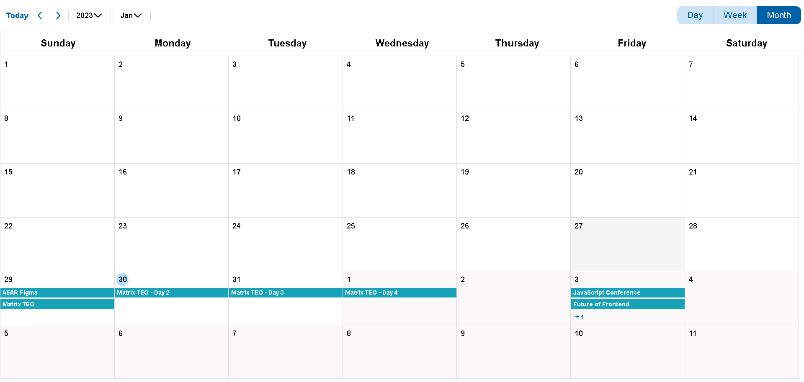
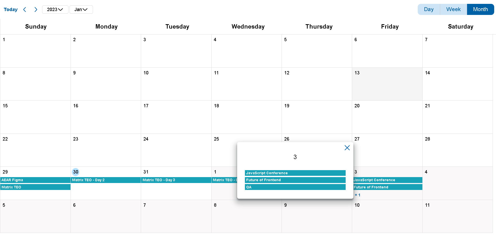
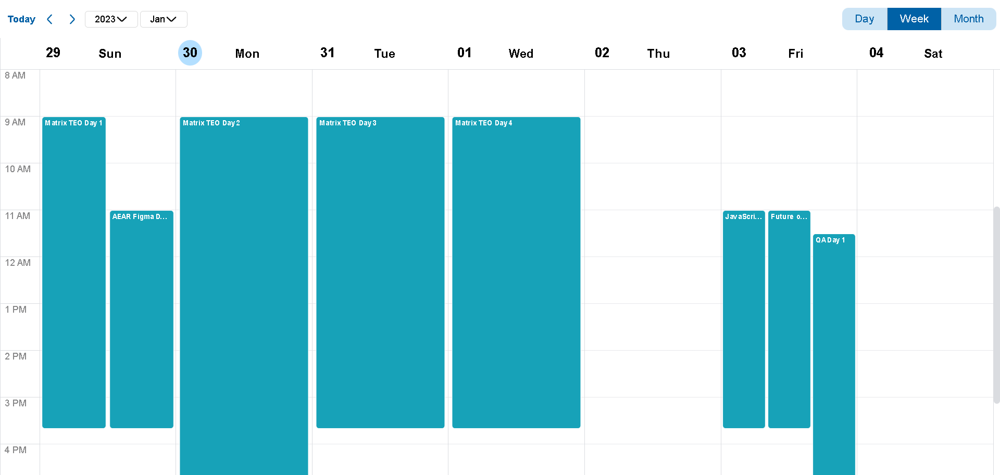
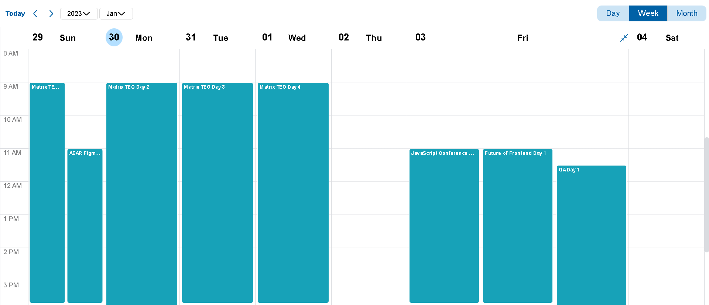
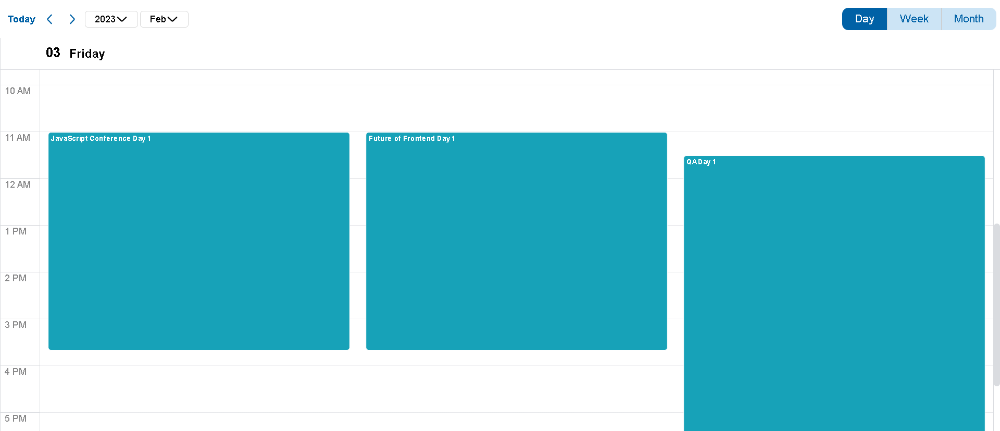

# Calendar scheduler 

- Month view: ✔️
- Week view: ✔️
- Day view: ✔️
- Drag and drop ❌
- Theming (Light and dark theme) ❌
- Localization ❌

## Run Locally

Clone the project

```bash
  git clone https://github.com/darkosimic025/Calendar.git
```

Go to the project directory

```bash
  cd calendar
```

Install dependencies

```bash
  yarn install
```

Start the server

```bash
  yarn start
```


## MonthView



## MonthViewModal



## WeekView



## WeekViewExpand



## DayView



## Tech Stack

 React, TypeScript, day.js, styled-components, framer-motion


